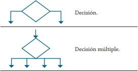
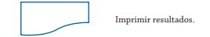
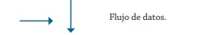

# SIMBOLOS PARA HACER UN DIAGRAMA DE FLUJO #
 1. * **Óvalo / Elipse:** Marca el punto de entrada o salida del algoritmo.

 2. * **Paralelogramo:** Marca la entrada de datos 


 


 3. * **Rectangulo** Marca un proceso 

 


 4. * **Rombo:** Determina una decision 

 


 5. * **Poligono irregular** Imprime los resultados




6. * **Flechas:** determina el flujo de los datos





7. * **Circulo** Son los conectores


## EJEMPLO 1: Calcular el area de un triangulo##


1. Inicio
2. Leer base, altura
3. Calcular área =(base * altura)/2
4. mostrar área
5. Fin 


## EJEMPLO 2: CALCULAR EL VOLUMEN DE UN CUBO##

1. Inicio
2. leer valores de A, B, C
3. Calcular volumen = A*B*C
4. mostrar el resultado: Volumen
5. Fin


## EJercicio 3: ##

Construye un algoritmo que, al recibir como datos el ID del empleado y los seis primeros sueldos del año, calcule el ingreso total semestral y el promedio mensual, e imprima el ID del empleado, el ingreso total y el promedio mensual.

## Solución ##

```
Inicio
Leer ID, S1, S2, S3, S4, S5, S6
Total = S1 + S2 + S3 + S4 + S5 + S6
PROMEDIO = Total/6
Escribir ID, Total, Promedio
Fin
```


## TAREA ##

```
Inicio
Leer Nota1, Nota2, Nota3, Nota4, Nota5, Nota6
Total= Nota1 + Nota2 + Nota3 + Nota4 + Nota5 + Nota6
Promedio= (Total/6)
Acumulado= Promedio*0.70
Necesario= (3.0 - Acumulado) / 0.30
Escribir Necesario
Fin
```


