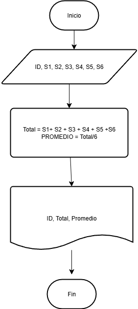

# SIMBOLOS PARA HACER UN DIAGRAMA DE FLUJO #
 1. * **Óvalo / Elipse:** Marca el punto de entrada o salida del algoritmo.

 2. * **Paralelogramo:** Marca la entrada de datos 


 


 3. * **Rectangulo** Marca un proceso 

 


 4. * **Rombo:** Determina una decision 

 


 5. * **Poligono irregular** Imprime los resultados


6. * **Flechas:** determina el flujo de los datos


7. * **Circulo** Son los conectores


## EJEMPLO 1: Calcular el area de un triangulo##


1. Inicio
2. Leer base, altura
3. Calcular área =(base * altura)/2
4. mostrar área
5. Fin 


## EJEMPLO 2: CALCULAR EL VOLUMEN DE UN CUBO##

1. Inicio
2. leer valores de A, B, C
3. Calcular volumen = A*B*C
4. mostrar el resultado: Volumen
5. Fin


## EJercicio 3: ##

Construye un algoritmo que, al recibir como datos el ID del empleado y los seis primeros sueldos del año, calcule el ingreso total semestral y el promedio mensual, e imprima el ID del empleado, el ingreso total y el promedio mensual.

## Solución ##

```
Inicio
Leer ID, S1, S2, S3, S4, S5, S6
Total = S1 + S2 + S3 + S4 + S5 + S6
PROMEDIO = Total/6
Escribir ID, Total, Promedio
Fin
```



## TAREA ##

```
Inicio
Leer Nota1, Nota2, Nota3, Nota4, Nota5, Nota6
Total= Nota1 + Nota2 + Nota3 + Nota4 + Nota5 + Nota6
Promedio= (Total/6)
Acumulado= Promedio*0.70
Necesario= (3.0 - Acumulado) / 0.30
Escribir Necesario
Fin
```


# CLASE MARTES 5 DE AGOSTO #

## Ejercicio 3 ##

Realice un algoritmo para determinar cuánto se debe pagar por equis cantidad de lápices considerando que si son 1000 o más el costo es de $85 cada uno; de lo contrario, el precio es de $90. Represéntelo con el pseudocódigo y el diagrama de flujo.

|Variables| Tipo| Comentario|
|---------|-----|-----------|
|Lapices | Entrada| Cantidad de Lapices|
|Precio | Salida| Precio total de los lapices|
|Valor_unidad| Intermedia | Valor unitario de cada lapiz|
|85, 90 | Constantes| No cambian|

## Pseudocodigo 

```
Inicio 
Leer 
Si lapices >= 1000:
    Valor_unidad = 85
Si no 
    Valor_unidad = 90
Fin Si
Precio= Lapices * Valor_unidad
Escribir " El valor total es:", Precio
Fin
```


## Ejercicio 4 

Un almacén de ropa tiene una promoción: por compras superiores a $250 000 se les aplicará un descuento de 15%, de caso contrario, sólo se aplicará un 8% de descuento. Realice un algoritmo para determinar el precio final que debe pagar una persona por comprar en dicho almacén y de cuánto es el descuento que obtendrá. Represéntelo mediante el pseudocódigo y el diagrama de flujo.

## Analisis

|Variables| Tipo| Comentario|
|---------|-----|-----------|
|total_compra | entrada | valor de la compra |
| descuento | salida | descuento según el valor de la compra |
| precio_final | salida| valor a pagar |
| 15%, 8% $250000 | constantes | Descuentos y valor limite |

## Pseudocodigo

```
Inicio 
Leer total_compra
Si total_compra > 250000
    descuento = total_compra * 0.15
Si no
    descuento = total_compra * 0.8
Fin si 
precio_final = total_compra - descuento
Escribir "valor a pagar", precio_final
Fin
```

## EJERCICIO #5 
El director de una escuela está organizando un viaje de estudios, y requiere determinar cuánto debe cobrar a cada alumno y cuánto debe pagar a la compañía de viajes por el servicio. La forma de cobrar es la siguiente: si son 100 alumnos o más, el costo por cada alumno es de $65.00; de 50 a 99 alumnos, el costo es de $70.00, de 30 a 49, de $95.00, y si son menos de 30, el costo de la renta del autobús es de $4000.00, sin importar el número de alumnos

## Analisis

|Variables| Tipo| Comentario|
|---------|-----|-----------|
|Alumnos| Entrada | cantidad total de estudiantes |
|Costos_alumno | Salida | costo que cada estudiante debe pagar |
|Costo_total | salida | costo que le representa a la escuela |
|100, 50-99, 30-49, | constantes | cantidad de alumnos |

## Pseudocodigo

```
Inicio
Leer Alumnos
Si Alumnos >= 100
    Costo_alumno = 65
Si no
    Si Alumnos >= 50 
        Costo_alumnos= 70
    Si no 
        Costo_total= 4000
        Costo_alumno= Cantidad total/ alumnos
    Fin Si
Fin Si
Costo_total = Costo_alumnos * Alumnos
Escribir "Costo_total , Costo_alumno "

Fin
```


## TAREA 2 #
```
Inicio
Leer Edad
Escribir "Ingresar dia de nacimiento"
Leer Dia_nacimiento

Escribir "Ingresar mes de nacimiento"
Leer Mes_nacimiento

Escribir "Ingresar año de nacimiento"
Leer Año_nacimiento

Dia_actual <= 12
Mes_actual <= 8
Año_actual<= 2025

Edad= Año_actual - Año_nacimiento

Si Mes_nacimiento > Mes_actual
 Edad = edad - 1
Si no
  Si Mes_nacimiento = Mes actual
   Si Dia_nacimiento > dia actual
     Edad= Edad-1
  Si no
    Si Dia_nacimiento= Dia_actual
     Edad= Edad
   Si no
    Edad = Edad
    Fin Si
   Fin Si
  Fin Si
Fin Si

Escribir " Tienes" , Edad, " Años"

Fin
```


## CLASE 12 AGOSTO ##

### Ejercicios de bucles ###

1. Se requiere un algoritmo para determinar, de N cantidades, Cuantas son cero, cuantas son menores a cero, cuantas son mayores a cero

 Realice el diagrama de flujo y el pseudocodigo. representarlo, utilizando el ciclo apropiado

 |Variables| Tipo|
|---------|-----|
| N, Cant | Entrada |
| ceros, mayores, iguales | contadoras |
| N | Control |

#### Pseudocodigo ####
```
Inicio
Leer N
ceros = 0
mayores = 0
menores = 0
Mientras N > 0:
    Leer cant
    Si cant > 0
        Mayores= mayores + 1
    Si no
        Si cant = 0:
            Ceros = ceros + 1
        Si no 
            Menores= menores+ 1
        Fin si
    Fin si
    N= N - 1
Fin Mientras
Mostras ceros, mayores, menores 
Fin 

```


2. Calcular el factorial de un numero entrero ingresado por el usuario 


 |Variables| Tipo|
|---------|-----|
| N | Entrada |
| Fact | Salida|
| i | Control |

 
 ```
  Inicio 
  Leer N
  Factorial = 1
  Mientras que N > 0
    Si N > 0
        Factorial = factorial * N
        N = N-1
        Fin mientas
    Fin si 
```


## TAREA ALGORITMO ##
```
Inicio
leer compra
    leer cuotas
    r = 0.02

    si cuotas <= 0 entonces
        escribir "numero de cuotas invalido"
    sino
        cuota = (compra + compra*r*cuotas) / cuotas

        i = 1
        mientras i <= cuotas hacer
            escribir "cuota ", i, ": ", cuota
            i = i + 1
        fin mientras
    fin si
fin

```


