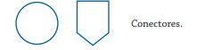

# SIMBOLOS PARA HACER UN DIAGRAMA DE FLUJO #
 1. * **Óvalo / Elipse:** Marca el punto de entrada o salida del algoritmo.

 2. * **Paralelogramo:** Marca la entrada de datos 
 
 3. * **Rectangulo** Marca un proceso 
 
 4. * **Rombo:** Determina una decision 
 
 5. * **Poligono irregular** Imprime los resultados

6. * **Flechas:** determina el flujo de los datos

7. * **Circulo** Son los conectores

## EJEMPLO 1: Calcular el area de un triangulo##
Inicio
Leer base, altura
Calcular área =(base * altura)/2
mostrar área
Fin 
## EJEMPLO 2: CALCULAR EL VOLUMEN DE UN CUBO##
1. Inicio
2. leer valores de A, B, C
3. Calcular volumen = A*B*C
4. mostrar el resultado: Volumen
5. fin